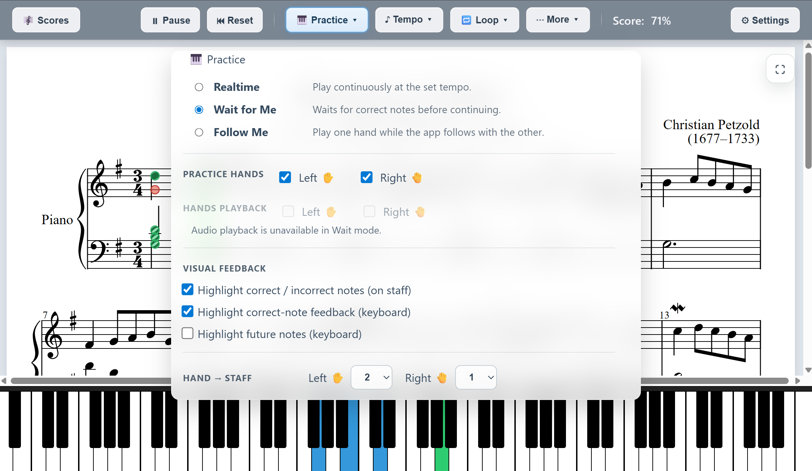
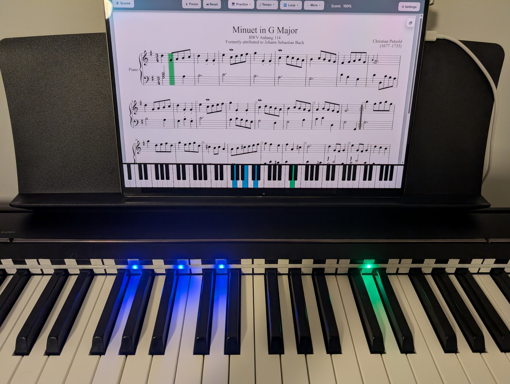

# 🎹 Piano Trainer Studio

Practice piano with real-time MIDI feedback, scoring, and optional LED guidance.

---

## 🌐 Try It

- App (GitHub Pages): [https://ztbishop.github.io/piano-trainer-studio/](https://ztbishop.github.io/piano-trainer-studio/)
- App (Custom Domain): [https://www.pianotrainerstudio.com/](https://www.pianotrainerstudio.com/)
- GitHub Repository: [https://github.com/ztbishop/piano-trainer-studio](https://github.com/ztbishop/piano-trainer-studio)

💻 Want to run locally? Download from the Releases page (no Git required)

👉 New here?
- Start with **Quick Start**
- Using iPad? See **iPad / iPhone**
- Want LED setup? Jump to **WLED / LED Setup**
- Want songs? See **Where can I find MusicXML songs?**

---

## 📦 Download (No Git Required)

You can download and run Piano Trainer Studio locally without cloning the repository:

👉 https://github.com/ztbishop/piano-trainer-studio/releases

- Download the latest `.zip` file under **Assets**
- Extract it to a folder on your computer

---

## 📸 Preview

### Main Interface

### Piano Setup with LED Feedback

---

## 🚀 What It Does

- 🎼 Play along with sheet music
- 🎹 Get real-time note accuracy feedback
- 🧠 Train using multiple practice modes
- 💡 Optional LED lighting synced to keys (WLED)

---

## ✨ Features

- 🎼 Load and play **MusicXML / MXL** piano scores
- 🔄 Import **MIDI, MuseScore 3.x, and Guitar Pro files 5.x** (auto-converted to MusicXML)
- 🎹 Real-time **MIDI keyboard feedback**
- 💡 Optional **LED visualization (WLED or MIDI LED devices)**
- 🌐 Runs in your browser — no install required
- 📱 iPad/iPhone support via MIDIWeb
- ⏱️ Various trainer modes

## 🎹 Practice Modes

- **Realtime** — play continuously at the set tempo
- **Wait for Me** — waits for correct notes before continuing
- **Follow Me** — play one hand while the app follows with the other

*Tip: Start with Wait for Me to learn notes, then try Follow Me to practice with timing.*

---

## ⚡ Quick Start (Desktop)

### 1. Install Node.js (Required)

Download and install Node.js (LTS recommended):  
https://nodejs.org/en

### 2. Run the app
Open:
`Launchers/Windows/Piano Trainer - Desktop.bat`

(or Mac equivalent)

### 3. Connect your MIDI keyboard
- USB recommended
- Bluetooth may vary by browser
- Optional: CME WIDI Bud Pro for wireless

### 4. Load a song
- Best: **MusicXML / MXL**
- Also supported: MIDI, MuseScore 3, Guitar Pro 5

### 5. Start practicing
- Press **Play** or open **Practice**
- Before pressing play, you can click any measure in the song to start playback there

### ℹ️ Notes
- No additional libraries need to be installed — all dependencies (including Tone.js) are already included
- If nothing opens, check the terminal/command window for errors
- On Mac, you may need to allow the `.command` file in System Settings → Security

---

## 🌐 Web Version (No Install)

Run directly from GitHub in your browser (Chrome recommended)

- Works great on desktop
- No helper required

⚠️ Notes:
- MIDI works on desktop browsers
- iOS Safari/Chrome do NOT support MIDI

---

## 📱 iPad / iPhone (MIDI Support)

iOS browsers do not support MIDI.

### ✅ Solution: MIDIWeb

1. Install **TestFlight**  
   [TestFlight on the App Store](https://apps.apple.com/us/app/testflight/id899247664)
2. Install **MIDIWeb**  
   [https://midiweb.cc](https://midiweb.cc)
3. Open MIDIWeb
4. Load Piano Trainer (GitHub or local network)
5. Connect your MIDI device

🔵 Bluetooth MIDI (Optional)
- Tap the Bluetooth icon in MIDIWeb
- Connect your device
- It will appear in Piano Trainer

**WLED light strips** will NOT work on iOS without a helper.
- Open the following on a Mac/PC on your local network:
- `Launchers/Windows/Piano Trainer - iPad (Wi-Fi).bat`
- (or Mac equivalent)
- Using the MIDIWeb app, connect to the resulting URL/IP displayed on your Mac/PC browser
- Be sure to use **http** (NOT https) when putting this URL into MIDIWeb

---

## 🎼 Supported Score Formats

### ✅ Best Compatibility
- `.xml`, `.musicxml`, `.mxl`

### 🔄 Supported via Conversion
- MIDI (`.mid`, `.midi`)
- MuseScore (`.mscx`, `.mscz`)
- Guitar Pro (`.gp`, `.gpx`, etc.)

⚠️ Notes:
- MusicXML is most reliable
- Converted formats may vary (MIDI does not contain key signatures, etc)
- Musescore 4+ import is experimental (<4 should work)
- Guitar Pro 6+ is experimental (<6 should be okay)
- If Musescore conversion issues occur → export to MusicXML using Musescore software
- If newer GuitarPro conversion issues occur → export to gp5 using TuxGuitar  or GuitarPro software

---

# 💡 WLED / LED Setup (Optional)

LEDs are optional but provide powerful real-time visual guidance while practicing.

---

## 🔹 Quick Overview

- Set **LED Lights → WLED** in Settings  
- Enter your **WLED IP address**  
- Set **LED Count (LEDs/m × strip length)**  
- Run **Test LED Strip**  
- Run **LED Calibration**  

---

## 🔹 Connection Modes

**HTTP JSON (default)**
- Works everywhere (desktop + iPad)
- Recommended for most users  

**DDP (low latency)**
- Run:
  `Launchers/Windows/WLED Helper - Low Latency (DDP).bat`
- Faster response  
- Not supported on iPad  

---

👉 **Full LED Lights setup guide:**  
[Open LED Setup Guide](docs/LED-Setup.html)

---

## 🎹 Supported Input

- MIDI keyboard (USB or Bluetooth adapter)
- Optimized for piano
- CME WIDI Bud Pro is useful for picking up Bluetooth MIDI as a USB device

---

## 💾 Library & Backup (IMPORTANT)

Songs are stored in your browser (IndexedDB).

⚠️ Browsers may clear this data.

### Always:
- Use **Scores → Backup Library**
- Use **Settings → Backup All Settings**

### Where can I find MusicXML songs?

- **[MuseTrainer](https://musetrainer.github.io/library)** — Public domain MusicXML library with popular songs formatted for piano

- **[PianoML](https://www.pianoml.org/library)** — Another useful library for piano MusicXML content

- **[OpenScore](https://fourscoreandmore.org/openscore/lieder/)** — 19th-century classical art songs for voice and piano

- **[MuseScore](https://musescore.com/)** — Large collection of music. **Use a FREE account.**
  - Decline any promotional pop-ups or screens asking you to upgrade to MuseScore PRO or start a 7-day free trial
  - When searching, filter for public domain & original to bypass paywalls
  - Filter for Piano / Solo
  - Under DOWNLOAD, choose MXL / MusicXML
  - If prompted to pay, ensure you are logged in and search for anything that is **not** an official score. Some scores can be downloaded while logged into a free account

- **[GitHub](https://github.com/)** — Can be used to find MusicXML, though results may vary
  - Search within GitHub with your song name plus: `extension:mxl OR extension:musicxml piano`
  - Search within Google with your song name plus: `filetype:mxl OR filetype:musicxml "piano"`

- **[MusicXML](https://www.musicxml.com/music-in-musicxml/)** — List of websites to find MusicXML files

---

## 📂 Library & Scores

- Open and save individual songs
- Backup and import saved libraries
- Bulk import songs into your library
- Organize songs into folders
- Rename and manage songs from the library

---

## ⚙️ Key Controls

- **Practice Menu** — core training modes and feedback
- **Tempo** — speed + metronome
- **Loop** — repeat sections
- **Display** — zoom, virtual keyboard
- **Transpose** — key or semitone changes

---

## ⚠️ Known Limitations

### File Conversion
- MIDI / MuseScore / Guitar Pro may:
  - Load imperfectly
  - Require cleanup
  - Fail on complex scores

👉 Export to MusicXML for best results

### iPad
- No Web MIDI in Safari/Chrome
- Requires MIDIWeb app
- Requires PC/Mac host for WLED support

### WLED
- DDP not supported on iPad

---

## 🛠️ Troubleshooting

### MIDI not detected
- Use Chrome (desktop)
- Use MIDIWeb (iPad)

### Import issues
- Convert to MusicXML (MuseScore app)

### Metronome MIDI Out sounds like a piano key
- MIDI Out click (Ch 10) Many devices play Channel 10 as percussion, but some keyboards may play regular instrument notes unless a Multi-timbral, GM, or drum-on-Ch10 receive mode is enabled.

### LEDs not working
- Verify IP
- Start with HTTP JSON

### Failed Musescore / GuitarPro conversion
- Use Musescore software or TuxGuitar to export.  

---

## 📘 Notes

- Web-first app
- Desktop = best experience
- iPad supported via MIDIWeb
- Do **not** block browser access requests
  - These are needed for MIDI and/or WLED
- Virtual Keyboard can be disabled in the Display menu
- Full-screen toggle is available in the top-right corner of the sheet

---

## 🙌 Credits

- OSMD
- WLED
- MIDIWeb
- MuseTrainer Library
- Node.js
- Tone.js
- Webmscore

---

## 📌 Project Status

Actively developed. Feedback and suggestions welcome.

---

## ❤️ Support

If you find this useful, consider sharing or contributing!

---

## License

AGPL v3.0
