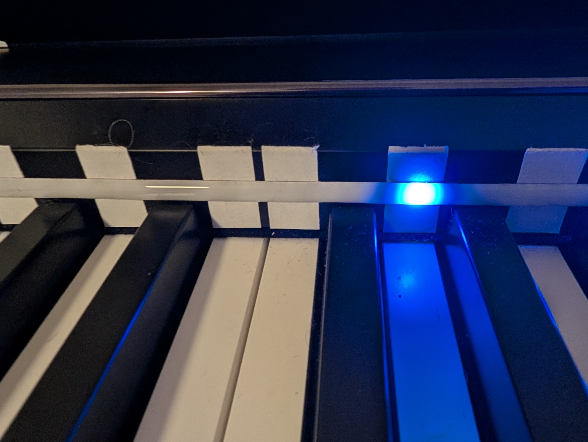
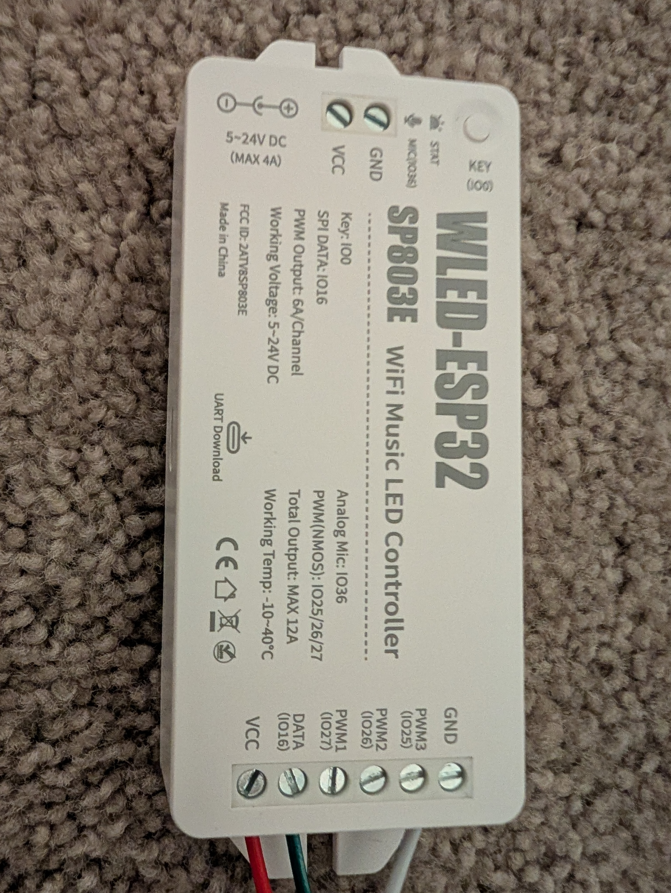

# 💡 LED Setup Guide (WLED)

This guide walks you through setting up LED feedback for Piano Trainer Studio using WLED.

LEDs are optional — but they are one of the most powerful features of the app for learning and visualization.

---

## 📸 Example Setup

### Full Piano Setup

### LED Strip Close-Up

### WLED Controller Example

---

## 🔌 Hardware Overview

### Recommended Components

- **Controller:** ESP32 WLED Controller (BTF / Athom / similar)
- **LED Strip:** WS2812B (5V addressable)
- **Power Supply:** 5V DC (5A–6A recommended)

---

## 🛒 Example Hardware (Reference)

### Controller  
BTF-Lighting ESP32 WLED Controller  
https://www.amazon.com/BTF-LIGHTING-Controller-Dynamic-Download-Addressable/dp/B0FB38FDCS?pd_rd_w=WR8cE  

### LED Strip  
200 LEDs/m, 5mm PCB, 2m length  
https://a.aliexpress.com/_mOxIFCV  

### Power Supply  
5V, 6A DC Power Supply (5.5mm x 2.1mm barrel)

---

## ⚙️ Step 1 — Set Up WLED

1. Power your controller  
2. Connect to its Wi-Fi network  
3. Open browser → http://4.3.2.1  
4. Connect it to your home Wi-Fi  
5. Find your device IP (example: 192.168.1.xxx)  

👉 You will use this IP in Piano Trainer

---

## 🔌 Step 2 — Wiring the LED Strip

Typical wiring:

- **VCC → 5V**
- **GND → GND**
- **DATA → GPIO (often IO16 on this controller)**

⚠️ Incorrect wiring can damage your LEDs

---

## 🎯 Step 3 — Mounting the Strip (IMPORTANT)

Recommended approach:

- Mount strip **above the keys**
- Add **white stickers extending from keys (optional but highly recommended)**

### Why this helps:
- Creates a visual “extended key”
- Makes LED alignment MUCH clearer
- Improves learning accuracy

---

## 🎛️ Step 4 — Configure in Piano Trainer

### In the App:

- **LED Lights:** WLED  
- **WLED IP Address:**  
  → Enter your WLED device IP  

---

### LED Count (IMPORTANT)

Set this based on your strip:

LED Count ≈ LEDs per meter × strip length (meters)

Example:
- 200 LEDs/m × 1.2m ≈ 240 LEDs

---

### Test It

- Click **Test LED Strip**
- If lights:
  - don’t reach full width → LOWER count
  - overshoot → LOWER count
- Adjust until it visually matches your keyboard

👉 This value is the foundation for calibration — get it right first

---

## 🔆 Brightness Settings (Recommended Starting Point)

- **Master:** 20  
- **Future:** 1  

If future notes don’t appear → increase slightly

---

## 🎚️ Step 5 — Calibration

### How it works:

1. Click **Start LED Calibration**
2. Press a piano key (or click virtual key)
3. Use:
   - Move Left
   - Move Right
4. Repeat across keyboard

---

### Why calibration matters:

- Fixes spacing inconsistencies  
- Improves accuracy for learning  
- Ensures LEDs match note positions exactly  

---

## 🎨 LED Behavior

- Expected notes:
  - Left hand → Blue  
  - Right hand → Green  

- Future notes:
  - Dimmer blue/green  

- Correct notes:
  - Warm gold/white  

- Incorrect notes:
  - Red  

---

## ⚡ Connection Modes

### HTTP JSON (Default)

- Works everywhere (desktop + iPad)  
- No helper required  
- Slightly higher latency  

👉 Recommended for most users  

---

### DDP (Low Latency Mode)

Run helper:

Launchers/Windows/WLED Helper - Low Latency (DDP).bat

- Faster response  
- Better for advanced setups  

⚠️ Notes:
- Requires Node.js  
- Not supported on iPad  
- Uses localhost bridge  

---

## 🧠 Tips for Best Results

- Lower brightness if LEDs are too intense  
- Use high-density strips (160–200 LEDs/m)  
- Keep LED strip straight and centered  
- Calibrate AFTER setting LED count  
- Use stickers for best visual alignment  

---

## ⚠️ Troubleshooting

**LEDs not responding**
- Check IP address  
- Ensure WLED is connected to Wi-Fi  
- Try HTTP JSON mode first  

**Only part of strip lights**
- LED count too high or low  

**Misaligned lights**
- Run calibration  

**DDP not working**
- Make sure helper is running  
- Confirm localhost connection  

---

## 📌 Final Notes

- LED setup is optional but highly recommended  
- Once calibrated, it dramatically improves learning speed  
- Works best with proper strip placement + correct LED count  
